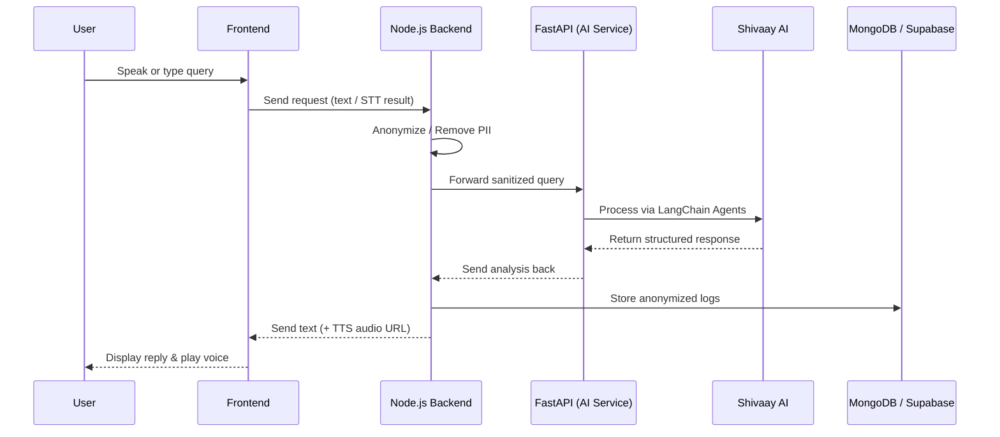

# 🩺 MediWagon — AI-Powered Digital Health Assistant


MediWagon is a next-generation **AI-powered health assistant platform** designed to make healthcare accessible, connected, and intelligent. With its built-in bilingual AI companion **Asha**, MediWagon empowers users to book appointments, consult virtually, access medical records, and arrange transport through simple voice or chat commands.

*(Insert Screenshot / Demo GIF here)*

---

## 🚀 Overview

> “Your one-stop health companion — Speak. Schedule. Heal.”

MediWagon bridges patients, doctors, and healthcare services through a unified web platform. It is powered by **Asha**, an AI assistant capable of voice and chat-based interaction in **English and Hindi**, ensuring inclusivity. 

The system follows a **privacy-first architecture**—anonymizing user data before any AI processing—and integrates secure workflows for document handling.

---

## 🧠 Key Features

- 👩‍⚕️ **Smart AI Assistant (Asha):** Voice & chat-based interaction (Hindi + English) for symptom triage and queries.
- 🧾 **Patient Portal:** View, upload, and securely manage prescriptions & reports.
- 📅 **Doctor Booking:** AI-driven triage mapping symptoms to the right specialists.
- 🚑 **Transport Accessibility:** Integrated cab and ambulance booking for hospital visits.
- 💬 **Notifications:** Real-time updates for appointments and lab reports.
- 🔐 **Privacy First:** Data anonymization before AI processing and role-based access control.

---

## ⚙️ Tech Stack

The platform is designed with a modern microservices architecture:

| Layer | Technology |
|-------|-------------|
| **Frontend** | Next.js, React, Tailwind CSS, Radix UI |
| **Core Backend** | Node.js, Express, TypeScript, Supabase, Mongoose |
| **AI Microservice** | FastAPI (Python), LangChain, Shivaay AI (OpenAI-compatible) |
| **Text-to-Speech** | ElevenLabs API |
| **Document Processing** | PDF-lib, Tesseract.js |

---

## 📂 Repository Structure

```text
.
├── ai/                # FastAPI microservice for LangChain agents (Symptoms, Reports, Reminders)
├── backend/           # Node.js/Express core API (Auth, DB logic, TTS handling)
├── frontend/          # Next.js web application
└── README.md          # Project documentation
```

---

## 🧩 Architecture Overview



---

## 🚀 Setup & Installation

### Prerequisites
- Node.js (v18+)
- Python 3.9+
- MongoDB instance
- API Keys for ElevenLabs and Shivaay AI

### 1. Frontend Setup
```bash
cd frontend
npm install
npm run dev
```

### 2. Backend Setup
```bash
cd backend
npm install
# Create a .env file with your database and ElevenLabs keys
npm run dev
```

### 3. AI Service Setup
```bash
cd ai
pip install -r requirements.txt
# Create a .env file with SHIVAAY_API_KEY and SHIVAAY_BASE_URL
uvicorn main:app --reload
```

---

## 🤝 Contributing
Contributions are welcome! Please feel free to submit a Pull Request.

1. Fork the repository
2. Create your feature branch (`git checkout -b feature/AmazingFeature`)
3. Commit your changes (`git commit -m 'Add some AmazingFeature'`)
4. Push to the branch (`git push origin feature/AmazingFeature`)
5. Open a Pull Request
